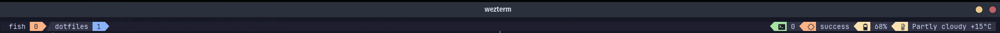

# tmux-ci
A small tmux plugin to monitor CI status in GitLab/GitHub in the tmux status bar.



## Install
This plugin requires the [github CLI](https://cli.github.com/) and/or the [gitlab CLI](https://gitlab.com/gitlab-org/cli/#installation) to function. Follow the according installation instructions for each and ensure that you have authenticated.

Install this plugin with [tpm](https://github.com/tmux-plugins/tpm) in your `.tmux.conf`:

```tmux
set -g @plugin 'GNMoseke/tmux-ci'
```

Or install manually by cloning this repository and running the script at the end of your `.tmux.conf`:
```tmux
run-shell /path/to/plugin/tmux-ci.tmux
```
## Use
Add `#{ci}` in your status-right config:

```tmux
set-option -g status-right "#{ci}"
```

If you use the excellent [catppuccin theme](https://github.com/catppuccin/tmux), you can also add it as a custom module as per their [docs](https://github.com/catppuccin/tmux/blob/main/custom/README.md):

```sh
# Requires https://github.com/GNMoseke/tmux-ci/tree/main

show_ci-status() { # This function name must match the module name!
  local index icon color text module

  index=$1 # This variable is used internally by the module loader in order to know the position of this module

  icon="$(  get_tmux_option "@catppuccin_ci-status_icon"  "󱥸"           )"
  color="$( get_tmux_option "@catppuccin_ci-status_color" "$thm_orange" )"
  text="$(  get_tmux_option "@catppuccin_ci-status_text"  "#{ci}" )"
  module=$( build_status_module "$index" "$icon" "$color" "$text" )

  echo "$module"
}
```

## Settings
There is only one configurable option:
- `set-option -g @tmux-ci-interval 5` sets the refresh rate in minutes for checking pipeline status. It defaults to 5. Ensure that if you set a very short time limit that you do not unintentionally get rate-limited.

## License & Credits
`tmux-ci` is [MIT licensed](./LICENSE) and was heavily inspired by the excellent [tmux-weather plugin](https://github.com/ilya-manin/tmux-weather)

